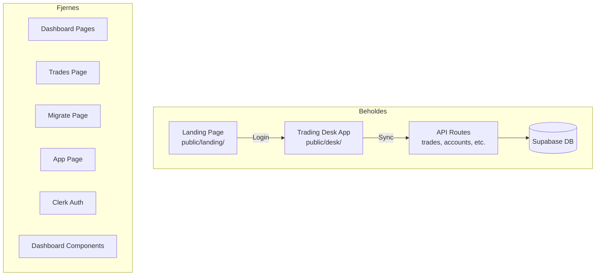

# Opprydding og Supabase Auth

## Nåværende arkitektur



## Filer som BEHOLDES

**Sider (2 stk):**

- [app/page.tsx](app/page.tsx) - Landing (iframe til public/landing/)
- [app/desk/page.tsx](app/desk/page.tsx) - Trading Desk (iframe til public/desk/)

**Statiske filer:**

- `public/landing/` - Landing page HTML
- `public/desk/` - Trading Desk app (HTML + JS)
- `public/icons/`, `public/manifest.json`, `public/sw.js`

**API Routes (brukes av desk app):**

- [app/api/trades/route.ts](app/api/trades/route.ts)
- [app/api/trades/[id]/route.ts](app/api/trades/[id]/route.ts)
- [app/api/accounts/route.ts](app/api/accounts/route.ts)
- [app/api/accounts/[id]/route.ts](app/api/accounts/[id]/route.ts)
- [app/api/settings/route.ts](app/api/settings/route.ts)
- [app/api/daily-archives/route.ts](app/api/daily-archives/route.ts)
- [app/api/playbook/route.ts](app/api/playbook/route.ts)
- [app/api/playbook/[id]/route.ts](app/api/playbook/[id]/route.ts)
- [app/api/symbols/route.ts](app/api/symbols/route.ts)

**Lib/config:**

- [lib/supabase/](lib/supabase/) - Supabase clients
- [lib/auth.ts](lib/auth.ts) - Auth helpers (oppdateres)
- [middleware.ts](middleware.ts) - Route protection (oppdateres)
- [supabase/schema.sql](supabase/schema.sql) - Database schema (oppdateres)

---

## Filer som SLETTES (17 stk)

**Sider:**

- `app/(dashboard)/` - Hele mappen (layout.tsx, dashboard/, trades/, migrate/)
- `app/app/page.tsx`
- `app/sign-in/` - Hele mappen
- `app/sign-up/` - Hele mappen
- `app/sign-out/page.tsx`
- `app/login/page.tsx`

**Komponenter:**

- `components/dashboard/` - Hele mappen (6 filer)
- `components/migration/` - Hele mappen
- `components/hero.tsx`
- `components/navbar.tsx`

**Hooks:**

- `hooks/` - Hele mappen (ikke brukt av desk app)

**API:**

- `app/api/webhooks/clerk/` - Clerk webhook
- `app/api/migrate/` - Migrering

---

## Endringer

### 1. Database Schema

Oppdater [supabase/schema.sql](supabase/schema.sql):

- Fjern `clerk_id` fra users-tabell
- Bruk `auth.uid()` direkte som user_id
- Forenkle RLS policies

### 2. Middleware

Oppdater [middleware.ts](middleware.ts):

- Erstatt Clerk med Supabase Auth
- Beskytt `/desk` og `/api/*` routes

### 3. Auth Helpers

Oppdater [lib/auth.ts](lib/auth.ts):

- Bruk Supabase `getUser()` i stedet for Clerk

### 4. API Routes (9 filer)

Oppdater alle API routes til å bruke Supabase Auth:

- Fjern `import { auth } from '@clerk/nextjs/server'`
- Bruk `supabase.auth.getUser()` for auth
- Fjern `clerk_id` lookup (bruk `auth.uid()` direkte)

### 5. Landing Page

Oppdater [public/landing/index.html](public/landing/index.html):

- Legg til Supabase Auth login modal
- Email/password login form
- Redirect til `/desk` etter login

### 6. Root Layout

Oppdater [app/layout.tsx](app/layout.tsx):

- Fjern ClerkProvider

### 7. Package.json

Fjern dependencies:

- `@clerk/nextjs`
- `svix`

---

## Ny forenklet struktur

```
app/
├── page.tsx          # Landing (iframe)
├── desk/
│   └── page.tsx      # Trading Desk (iframe)
├── api/
│   ├── trades/       # Trade CRUD
│   ├── accounts/     # Account CRUD
│   ├── settings/     # User settings
│   ├── daily-archives/
│   ├── playbook/
│   └── symbols/
├── globals.css
└── layout.tsx

lib/
├── auth.ts           # Supabase auth helpers
└── supabase/
    ├── client.ts
    └── server.ts

public/
├── landing/          # Landing page
├── desk/             # Trading Desk app
├── icons/
└── manifest.json

middleware.ts         # Supabase route protection
supabase/schema.sql   # Forenklet schema
types/database.ts
```

## Environment Variables

**Fjern:**

- `CLERK_SECRET_KEY`
- `NEXT_PUBLIC_CLERK_PUBLISHABLE_KEY`
- `CLERK_WEBHOOK_SECRET`

**Behold:**

- `NEXT_PUBLIC_SUPABASE_URL`
- `NEXT_PUBLIC_SUPABASE_ANON_KEY`
- `SUPABASE_SERVICE_ROLE_KEY`