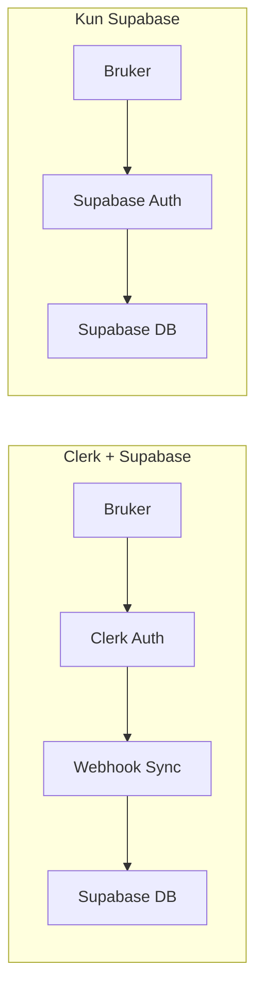
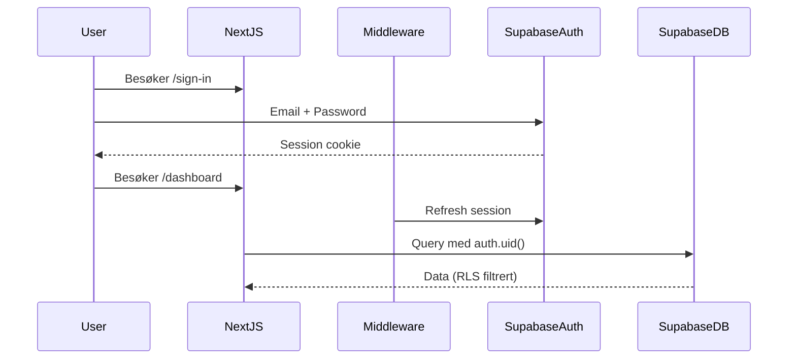

# Migrer fra Clerk til Supabase Auth

## Arkitektur - For og Etter



## Filer som skal endres

### ✅ 1. Database Schema ([supabase/schema.sql](supabase/schema.sql)) - FERDIG

- ~~Fjern `clerk_id` kolonne fra `users` tabell~~
- ~~Bruk `auth.uid()` direkte (Supabase Auth sin innebygde UUID)~~
- ~~Forenkle RLS policies - fjern `get_user_id_from_clerk()` funksjon~~
- ~~Lagt til trigger for auto-opprettelse av brukerprofil~~

### ✅ 2. Middleware ([middleware.ts](middleware.ts)) - FERDIG

- ~~Erstatt Clerk middleware med Supabase Auth session refresh~~
- ~~Beskytt ruter basert på Supabase session~~
- ~~Redirect til /sign-in hvis ikke autentisert~~

### ⏳ 3. Auth Helpers ([lib/auth.ts](lib/auth.ts))

- Erstatt `auth()` fra Clerk med Supabase `getUser()`
- Forenkle `getCurrentUser()` - ingen lookup via clerk_id

### ✅ 4. Supabase Server Client ([lib/supabase/server.ts](lib/supabase/server.ts))

- Allerede konfigurert - ingen endringer trengs

### ⏳ 5. Auth Sider (4 filer)

- [ ] [app/sign-in/[[...rest]]/page.tsx](app/sign-in/[[...rest]]/page.tsx) - Ny login form med Supabase
- [ ] [app/sign-up/[[...rest]]/page.tsx](app/sign-up/[[...rest]]/page.tsx) - Ny signup form med Supabase
- [ ] [app/sign-out/page.tsx](app/sign-out/page.tsx) - Bruk Supabase signOut
- [ ] [app/login/page.tsx](app/login/page.tsx) - Beholdes (redirect)

### ⏳ 6. Root Layout ([app/layout.tsx](app/layout.tsx))

- [ ] Fjern `ClerkProvider` wrapper

### ⏳ 7. API Routes (10 filer)

Alle routes bruker `auth()` fra Clerk - må endres til Supabase:

- [ ] [app/api/trades/route.ts](app/api/trades/route.ts)
- [ ] [app/api/trades/[id]/route.ts](app/api/trades/[id]/route.ts)
- [ ] [app/api/accounts/route.ts](app/api/accounts/route.ts)
- [ ] [app/api/accounts/[id]/route.ts](app/api/accounts/[id]/route.ts)
- [ ] [app/api/playbook/route.ts](app/api/playbook/route.ts)
- [ ] [app/api/playbook/[id]/route.ts](app/api/playbook/[id]/route.ts)
- [ ] [app/api/settings/route.ts](app/api/settings/route.ts)
- [ ] [app/api/symbols/route.ts](app/api/symbols/route.ts)
- [ ] [app/api/daily-archives/route.ts](app/api/daily-archives/route.ts)
- [ ] [app/api/migrate/route.ts](app/api/migrate/route.ts)

### ⏳ 8. Slett filer

- [ ] [app/api/webhooks/clerk/route.ts](app/api/webhooks/clerk/route.ts) - Ikke lenger trengs

### ⏳ 9. Dependencies ([package.json](package.json))

- [ ] Fjern: `@clerk/nextjs`, `svix`

## Ny Auth Flow



## Environment Variables

### Sett opp `.env.local` (VIKTIG!)

Opprett filen `.env.local` i prosjektets rot med:

```
NEXT_PUBLIC_SUPABASE_URL=https://your-project-ref.supabase.co
NEXT_PUBLIC_SUPABASE_ANON_KEY=your-anon-key
SUPABASE_SERVICE_ROLE_KEY=your-service-role-key
```

Finn verdiene her: https://supabase.com/dashboard/project/_/settings/api

### Fjern gamle Clerk variabler

- `CLERK_SECRET_KEY`
- `NEXT_PUBLIC_CLERK_PUBLISHABLE_KEY`  
- `CLERK_WEBHOOK_SECRET`

## Viktig: Kjør SQL Schema i Supabase

Etter at alle kodeendringer er gjort, kjør `supabase/schema.sql` i Supabase SQL Editor:

1. Gå til https://supabase.com/dashboard/project/_/sql
2. Lim inn innholdet fra `supabase/schema.sql`
3. Kjør scriptet

Dette vil:

- Opprette `users` tabell som linker til `auth.users`
- Sette opp alle RLS policies med `auth.uid()`
- Legge til trigger som auto-oppretter brukerprofil ved signup