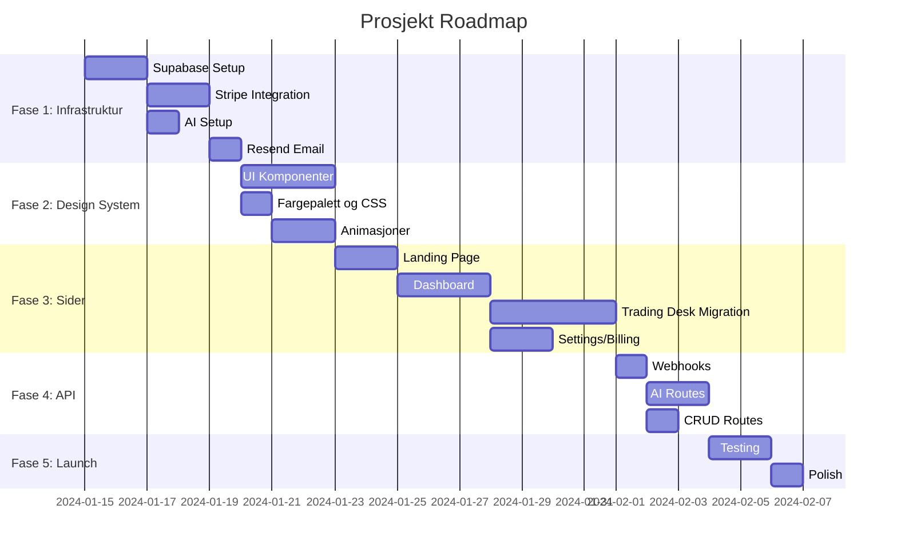
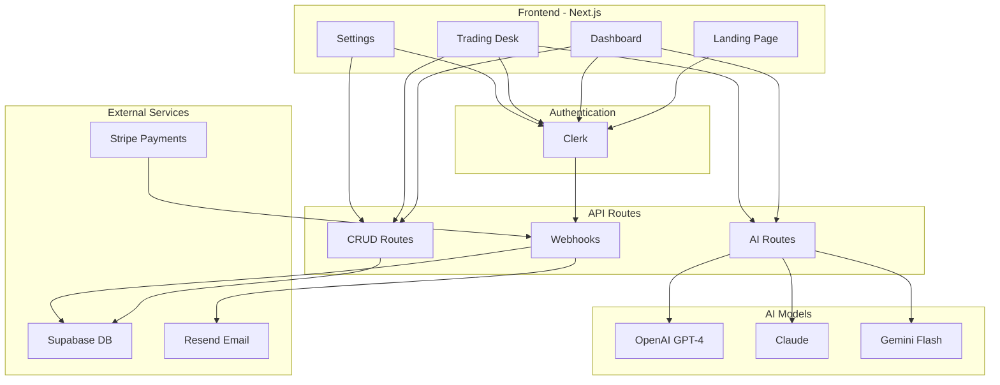
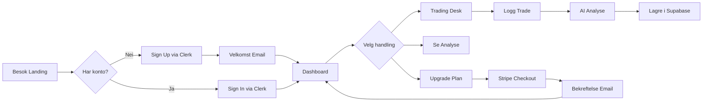

# Trading Desk - Aura Design Rebuild

## Visuelt Roadmap



## Systemarkitektur



## Brukerflyt



---

## Status: Pending

### Todo-liste
- [ ] Sett opp Supabase: installer SDK, opprett prosjekt, design skjema
- [ ] Sett opp Stripe: produkter, priser, webhooks, checkout
- [ ] Sett opp AI: OpenAI, Claude, Gemini med model routing
- [ ] Sett opp Resend: e-postmaler for onboarding og rapporter
- [ ] Bygg Aura-inspirert design system med UI-komponenter
- [ ] Redesign landing page med Aura-estetikk
- [ ] Bygg ny dashboard med oversikt og AI-widgets
- [ ] Migrer trading desk fra iframe til React-komponenter
- [ ] Implementer API-ruter for trades, AI, webhooks
- [ ] Lag settings/billing side med Stripe Customer Portal

---

## Designinspirajon: Aura.build

Aura.build har en moderne, minimalistisk SaaS-estetikk med:

- Mørkt tema med subtile gradienter
- Glassmorphism-effekter (backdrop-blur, semi-transparente kort)
- Smooth animasjoner og micro-interactions
- Stor, bold typografi med god hierarki
- Fargerike aksentfarger på mørk bakgrunn
- Rene, avrundede UI-komponenter

---

## Fase 1: Prosjektoppsett og Infrastruktur

### 1.1 Database - Supabase

- Installer `@supabase/supabase-js`
- Opprett Supabase-prosjekt og konfigurer miljøvariabler
- Design databaseskjema:

```sql
-- users (synkronisert med Clerk)
users
├── id (uuid, PK)
├── clerk_id (text, unique)
├── email (text)
├── subscription_tier (enum: free/pro/enterprise)
├── created_at (timestamp)

-- trades
trades
├── id (uuid, PK)
├── user_id (uuid, FK → users)
├── symbol, entry, exit, pnl, etc.

-- accounts
accounts
├── id, user_id, name, balance, category

-- ai_usage
ai_usage
├── id, user_id, tokens_used, model, timestamp
```

### 1.2 Betalinger - Stripe

- Installer `stripe` og `@stripe/stripe-js`
- Opprett produkter/priser i Stripe Dashboard
- Implementer webhook-håndtering for subscription events
- Lag pricing-side med tier-sammenligning

### 1.3 E-post - Resend

- Installer `resend`
- Opprett e-postmaler for:
  - Velkomst-e-post ved registrering
  - Betalingsbekreftelse
  - Trading-rapporter (ukentlig/månedlig)

### 1.4 AI-integrasjoner

- Installer `openai`, `@anthropic-ai/sdk`, `@google/generative-ai`
- Opprett API-ruter med model-routing:
  - **OpenAI GPT-4**: Trading-analyse, risikokalkuleringer
  - **Claude**: Kreativ innholdsgenerering, journalskriving
  - **Gemini Flash**: Raske oppslag, kategorisering

---

## Fase 2: Design System - Aura-stil

### 2.1 Ny komponentbibliotek

Opprett `components/ui/` med Aura-inspirerte komponenter:

```
components/ui/
├── button.tsx        # Gradient-knapper med glow-effekt
├── card.tsx          # Glassmorphism-kort
├── input.tsx         # Moderne input med floating labels
├── badge.tsx         # Status-badges
├── modal.tsx         # Animated modals
├── sidebar.tsx       # Collapsible sidebar
├── navbar.tsx        # Sticky navbar med blur
└── pricing-card.tsx  # Stripe-integrert pricing
```

### 2.2 Fargepalett og CSS-variabler

Oppdater `app/globals.css`:

```css
:root {
  --background: #0a0a0f;
  --foreground: #fafafa;
  --card: rgba(255,255,255,0.03);
  --card-border: rgba(255,255,255,0.08);
  --primary: #6366f1;      /* Indigo */
  --primary-glow: rgba(99,102,241,0.3);
  --accent: #22d3ee;       /* Cyan */
  --success: #10b981;
  --warning: #f59e0b;
  --error: #ef4444;
}
```

### 2.3 Animasjoner

- Framer Motion for page transitions
- Subtle hover-effekter på alle interaktive elementer
- Skeleton loaders for async content

---

## Fase 3: Sider og Ruter

### 3.1 Landing Page (redesign)

`app/page.tsx` - Aura-inspirert hero med:

- Animated gradient background
- Feature-grid med glassmorphism-kort
- Pricing-seksjon med Stripe-checkout
- Testimonials/social proof
- CTA med glow-effekt

### 3.2 Dashboard (ny)

`app/dashboard/page.tsx`:

- Oversikt over trades, P&L, goals
- AI-innsikt widget
- Subscription status
- Quick actions

### 3.3 Trading Desk (redesign)

Behold funksjonalitet fra `public/desk/`, men:

- Migrer fra iframe til native React-komponenter
- Integrer med Supabase for datalagring
- Legg til AI-analyse per trade

### 3.4 Settings/Billing

`app/settings/page.tsx`:

- Profil-innstillinger
- Stripe Customer Portal link
- AI-bruk statistikk

---

## Fase 4: API-ruter

```
app/api/
├── webhooks/
│   ├── stripe/route.ts      # Stripe webhooks
│   └── clerk/route.ts       # Clerk webhooks (sync users)
├── ai/
│   ├── analyze/route.ts     # OpenAI - trade analysis
│   ├── journal/route.ts     # Claude - journal writing
│   └── classify/route.ts    # Gemini - quick tasks
├── trades/route.ts          # CRUD for trades
├── accounts/route.ts        # CRUD for accounts
└── reports/route.ts         # Generate + email reports
```

---

## Fase 5: Subscription Tiers

| Feature | Free | Pro ($19/mo) | Enterprise ($49/mo) |
|---------|------|--------------|---------------------|
| Trades | 50/mo | Unlimited | Unlimited |
| AI Analysis | 10/mo | 100/mo | Unlimited |
| Accounts | 2 | 10 | Unlimited |
| Reports | Basic | PDF + Email | Custom |
| Support | Community | Email | Priority |

---

## Filstruktur etter rebuild

```
app/
├── (auth)/
│   ├── sign-in/[[...rest]]/page.tsx
│   └── sign-up/[[...rest]]/page.tsx
├── (dashboard)/
│   ├── layout.tsx           # Dashboard layout med sidebar
│   ├── dashboard/page.tsx   # Hovedoversikt
│   ├── trades/page.tsx      # Trade journal
│   ├── analysis/page.tsx    # AI-analyse
│   └── settings/page.tsx    # Innstillinger + billing
├── (marketing)/
│   ├── layout.tsx           # Marketing layout
│   ├── page.tsx             # Landing page
│   └── pricing/page.tsx     # Pricing
├── api/                     # API routes
└── globals.css
components/
├── ui/                      # Design system
├── dashboard/               # Dashboard-spesifikke
└── marketing/               # Landing page komponenter
lib/
├── supabase.ts             # Supabase client
├── stripe.ts               # Stripe helpers
├── ai.ts                   # AI model routing
└── resend.ts               # Email helpers
```

---

## Miljøvariabler påkrevd

```env
# Supabase
NEXT_PUBLIC_SUPABASE_URL=
NEXT_PUBLIC_SUPABASE_ANON_KEY=
SUPABASE_SERVICE_ROLE_KEY=

# Stripe
STRIPE_SECRET_KEY=
STRIPE_WEBHOOK_SECRET=
NEXT_PUBLIC_STRIPE_PUBLISHABLE_KEY=

# AI
OPENAI_API_KEY=
ANTHROPIC_API_KEY=
GOOGLE_AI_API_KEY=

# Resend
RESEND_API_KEY=

# Clerk (eksisterende)
NEXT_PUBLIC_CLERK_PUBLISHABLE_KEY=
CLERK_SECRET_KEY=
```

---

## Estimert tidsbruk

- Fase 1 (Infrastruktur): 2-3 timer
- Fase 2 (Design System): 3-4 timer
- Fase 3 (Sider): 4-6 timer
- Fase 4 (API): 2-3 timer
- Fase 5 (Stripe tiers): 1-2 timer
- Testing og polish: 2-3 timer

**Total: ~15-20 timer**
